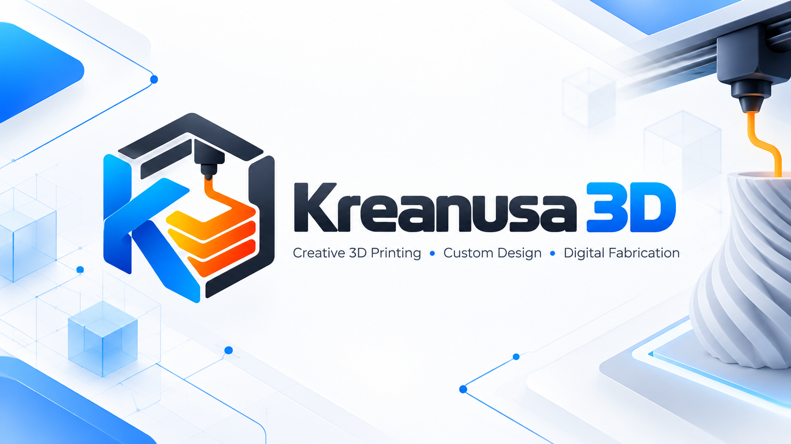

  

<h1 align="center">Kreanusa 3D</h1>

  <strong>Creative 3D Printing • Custom Design • Digital Fabrication</strong>

  Turning creative ideas into physical products through modern 3D printing.

---

## About Kreanusa 3D

**Kreanusa 3D** is a 3D printing brand focused on creating unique, functional, and customizable products.

Our goal is to combine creativity, technology, and digital fabrication to transform ideas into real-world products.

We are building an integrated e-commerce platform where customers can discover ready-made products, order customized designs, and interact with the Kreanusa 3D ecosystem.

## What We're Building

Our platform is being developed around two main applications:

### Kreanusa Web

The customer-facing e-commerce platform where customers will be able to:

- Explore 3D printed products
- View detailed product information
- Order customizable products
- Manage shopping carts
- Place and track orders
- Manage customer accounts

### Kreanusa Admin

The internal management platform for managing the Kreanusa 3D ecosystem, including:

- Products
- Product categories
- Inventory
- Customer orders
- Customers
- Promotions
- Content
- Store operations

## Technology

Our platform is being built with modern web technologies.

  
  
  
  
  
  

## Repositories

The Kreanusa 3D platform will initially consist of:

| Repository | Purpose |
| --- | --- |
| `kreanusa-web` | Main customer-facing e-commerce website |
| `kreanusa-admin` | Administration and store management platform |

Additional services and repositories may be introduced as the platform grows.

---

  <strong>Kreanusa 3D</strong> 
  Create. Print. Make it real.

